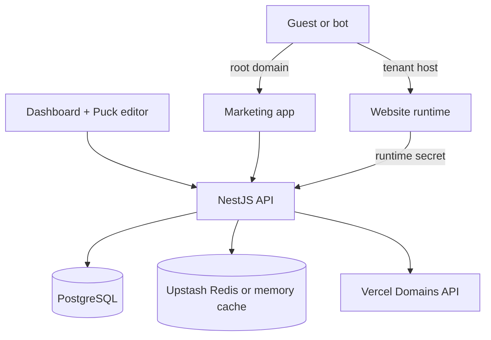
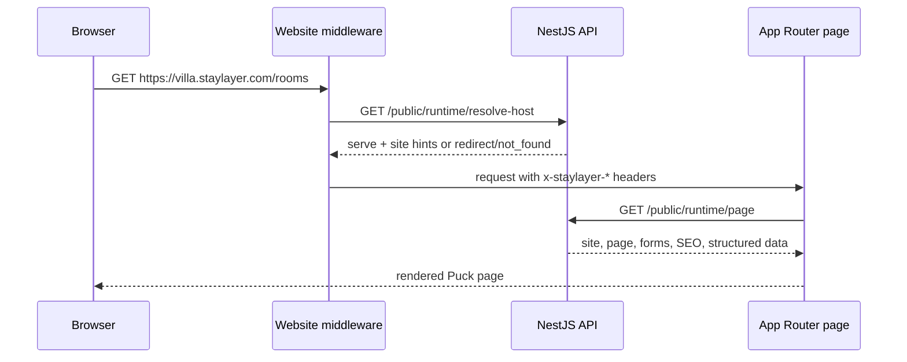

# StayLayer Website Runtime

`apps/website` is the shared public renderer for every customer hospitality site. It is one Next.js 15 App Router deployment on Vercel, not a per-customer project.

The Website app never reads the database directly. It resolves the incoming hostname through the NestJS API, fetches a host-scoped published or preview payload, and renders that payload with `@staylayer/puck-components`.

## Architecture





## Runtime Entry Points

- [middleware.js](middleware.js) handles reserved app hosts, tenant hostname resolution, canonical redirects, and request hints.
- [app/[[...slug]]/page.jsx](app/[[...slug]]/page.jsx) fetches the runtime payload, generates metadata, and renders tenant pages.
- [lib/runtime/public-site-api.js](lib/runtime/public-site-api.js) is the only Website-to-API runtime client for pages and routes.
- [components/runtime/TenantPuckRenderer.jsx](components/runtime/TenantPuckRenderer.jsx) renders Puck JSON with live form runtime wiring and internal-link navigation.
- [app/api/preview/route.js](app/api/preview/route.js) validates signed preview links and enables draft mode.
- [app/api/revalidate/route.js](app/api/revalidate/route.js) invalidates host, route, page, and site cache tags.
- [app/robots.js](app/robots.js) and [app/sitemap.js](app/sitemap.js) generate host-aware SEO resources.

The temporary Pages Router form routes in [pages/api/forms](pages/api/forms) remain as a bridge until the form runtime is moved fully into App Router handlers.

## Required Environment

```bash
API_INTERNAL_URL=http://localhost:4000
API_URL=http://localhost:4000
WEBSITE_RUNTIME_SECRET=replace-me
PREVIEW_TOKEN_SECRET=replace-me
PLATFORM_ROOT_DOMAIN=staylayer.localhost
MARKETING_APP_ORIGIN=http://localhost:3002
DASHBOARD_APP_ORIGIN=http://localhost:5173
PUBLIC_IMAGE_HOSTS=images.example.com,assets.example.com
```

Production also needs the matching API-side values: `WEBSITE_RUNTIME_SECRET`, `PREVIEW_TOKEN_SECRET`, `PLATFORM_ROOT_DOMAIN`, `MARKETING_APP_ORIGIN`, `DASHBOARD_APP_ORIGIN`, `WEBSITE_VERCEL_PROJECT_ID`, `WEBSITE_VERCEL_PROJECT_NAME`, and optional Upstash Redis credentials. Set `WEBSITE_VERCEL_RECOMMENDED_APEX_IPV4` and `WEBSITE_VERCEL_RECOMMENDED_CNAME` to the A and CNAME values shown in the Vercel dashboard for the shared Website project so customer DNS diagnostics match Vercel's current generated records.

## API Contract

Website expects these NestJS routes:

- `GET /public/runtime/resolve-host`: resolves custom domains and platform subdomains into `serve`, `redirect`, or `not_found`.
- `GET /public/runtime/page`: returns the assembled Puck, SEO, forms, navigation, and structured-data payload for one hostname and path.
- `GET /public/runtime/routes`: returns published routes for host-aware `sitemap.xml`.
- `POST /sites/:siteId/preview-links`: creates signed preview URLs for Dashboard users.
- `POST /api/revalidate` on Website: accepts `{ siteId, hosts, paths }` from the API and invalidates cache tags.

Every public-runtime API call must include `x-website-runtime-secret`. The Website app treats `x-staylayer-site-id` as a convenience hint only; the API remains the source of tenant truth.

## Local Development

Run the API and Website in separate terminals:

```bash
pnpm --filter @staylayer/api dev
pnpm --filter @staylayer/website dev
```

Use hostnames under `PLATFORM_ROOT_DOMAIN` for platform-subdomain testing, for example `sunset-villa.staylayer.localhost:3000` when your local DNS setup supports wildcard localhost names.

## Vercel Setup

Configure the Vercel project root directory as `apps/website` and use [vercel.json](vercel.json). Attach the wildcard platform domain and all customer custom domains to this single project.

Recommended ownership:

- Marketing project: `staylayer.com` and `www.staylayer.com`
- Dashboard project: `dashboard.staylayer.com`
- Website project: `*.staylayer.com` plus customer custom domains

Publishing is a database write plus tag revalidation. It should not trigger a new Website build.

## Implementation Notes

- Unknown hosts return the App Router not-found experience without exposing stack traces.
- Draft rendering uses signed preview links, `draftMode()`, `no-store` fetching, and `noindex` metadata.
- Published payloads use short API caching plus Next fetch tags: `host:<hostname>`, `routes:<hostname>`, and `page:<hostname>:<pathname>`.
- Custom domains are verified and attached by the API against `WEBSITE_VERCEL_PROJECT_ID`.
- Hospitality SEO is assembled server-side: canonical URLs, Open Graph data, robots behavior, sitemap routes, business JSON-LD, and breadcrumbs.
